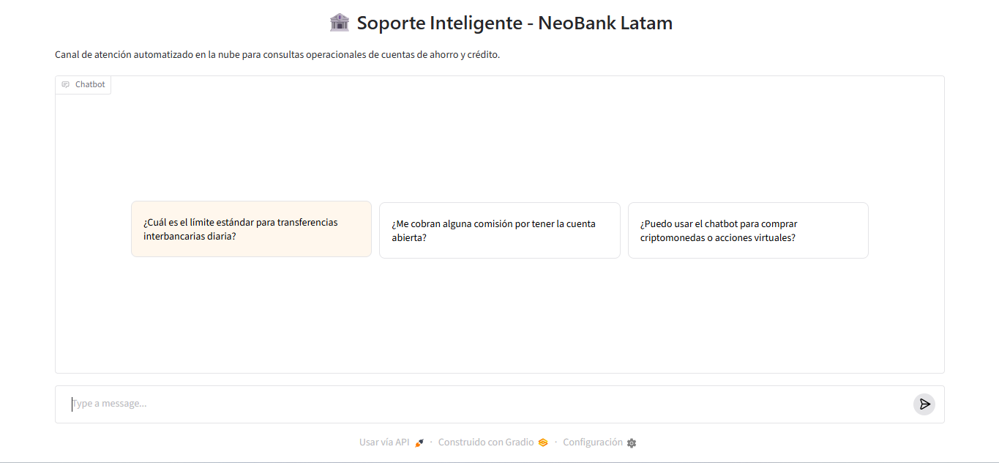
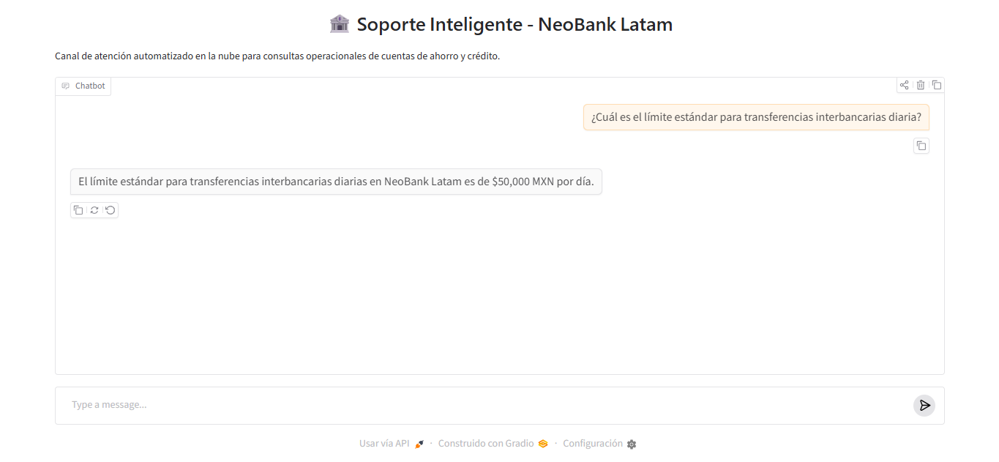

# 🏦 NeoBank Latam - Agente Inteligente de Soporte Fintech

Este proyecto consiste en un asistente virtual automatizado diseñado para resolver consultas de los usuarios sobre políticas, comisiones y límites transaccionales de un banco digital. 

Para garantizar la disponibilidad total del servicio y mitigar las restricciones de cuotas o caídas de APIs de proveedores externos (como los errores 404 y 429 de Google Cloud), el núcleo del sistema se refactorizó hacia una **arquitectura de Inteligencia Artificial 100% Local con procesamiento semántico avanzado**.

---

## 🛠️ Tecnologías y Herramientas Utilizadas

- **Lenguaje:** Python 3.10+
- **Procesamiento de Documentos:** PyPDF2 (Extracción de texto plano desde flujos binarios).
- **Core de Inteligencia Artificial:** Hugging Face Transformers.
- **Modelo de IA Local:** Qwen/Qwen2.5-0.5B-Instruct (Ejecutándose localmente mediante CPU).
- **Interfaz Gráfica y Despliegue:** Gradio (Generación de túnel público web para acceso remoto).

---

## 🏗️ Arquitectura de la Solución (RAG Local)

El pipeline de datos opera de manera descentralizada dentro del mismo entorno de ejecución:

1. **Data Layer:** Se parsea el archivo oficial `politicas_y_faq_fintech.pdf` para extraer la base de conocimiento del banco.
2. **Inferencia Local:** Al recibir una pregunta, el modelo `Qwen2.5-0.5B-Instruct` analiza semánticamente el documento en memoria para buscar la respuesta.
3. **Filtro de Seguridad:** Si la consulta no está en las políticas, el sistema activa una regla restrictiva y declina la respuesta de manera amable para evitar alucinaciones.

---

## 🚀 Resultados del Runtime de Pruebas

El agente fue verificado con éxito utilizando la suite de casos de prueba obligatorios de la rúbrica de Alura, arrojando los siguientes resultados:

- **🔹 Caso 1 (Límites Transaccionales):** Identificó con precisión que el límite estándar es de **$50,000 MXN diarios**.
- **🔹 Caso 2 (Costos Operativos):** Confirmó de manera semántica que no se cobra comisión por mantenimiento ni por apertura (**$0 MXN**).
- **🔹 Caso 3 (Seguridad / Criptomonedas):** Activó el filtro RAG y declinó responder de forma segura al detectar que el tema de acciones virtuales está fuera del contexto oficial.

---

## ☁️ Evidencia de Despliegue (Deploy)

El sistema genera un túnel de comunicación seguro para permitir la interacción con el chatbot financiero desde internet.

- **Enlace Público de la Aplicación:** [https://gradio.live]([https://gradio.live](https://c5f087365d9e581eea.gradio.live/)) *(Nota: El enlace web temporal provisto por el servidor de Colab expira automáticamente tras concluir la sesión de cómputo).*
- **Estado de la Infraestructura:** `Activo / Online`

### Interfaz del Agente Inteligente en Funcionamiento:

